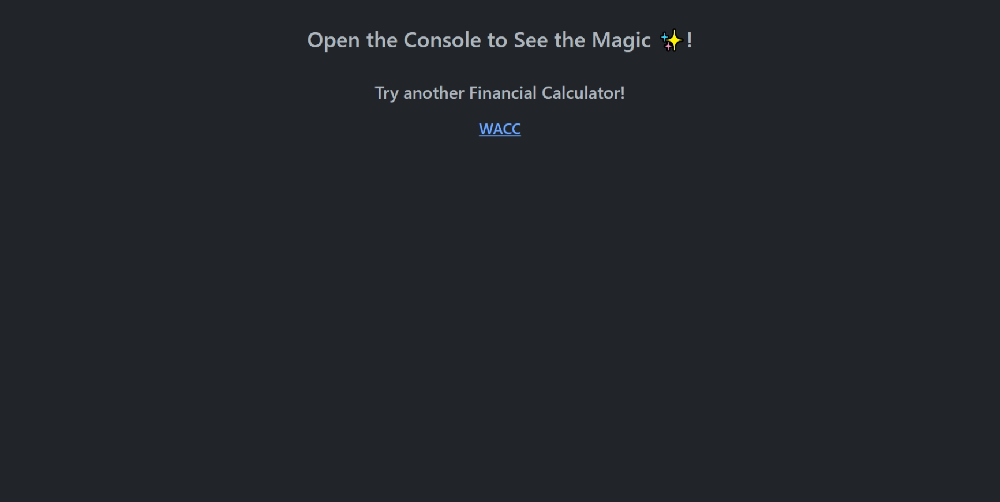
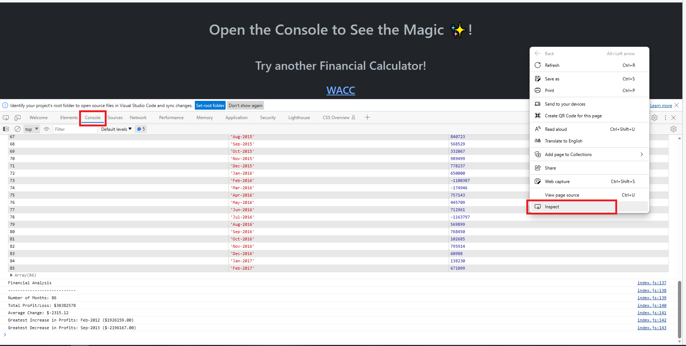

# JavaScript Fundamentals: Console Finances

## Table of Contents

- [Description](#description)
- [Motivation](#motivation)
- [Learning Objectives](#learning-objectives)
- [Project Highlights](#project-highlights)
- [Installation](#installation)
- [Usage](#usage)
- [Screenshots](#screenshots)
- [Accessibility Testing](#accessibility-testing)
- [Resources](#resources)
- [License](#license)

## Description

By mastering JavaScript fundamentals, I set a strong foundation for my journey as a front-end web developer. This challenge propels me towards dynamic and interactive web applications, enriching my portfolio and career prospects. As I advance, I'll build upon these skills and explore more complex frameworks, shaping the future of web development.

## Motivation

As I embarked on this project, the question "Why dive into JavaScript?" resonated with me. Beyond assignments, my motivation is rooted in understanding the backbone of web development. JavaScript empowers me to breathe life into static websites, crafting engaging user experiences. This skill enriches my portfolio and opens doors to innovative web projects.

## Learning Objectives

Through this project, I aim to achieve the following:

- **Master JavaScript Basics:** Gain a solid understanding of language syntax, data types, and operators.
- **Conditional Logic Mastery:** Create logical structures using if...else statements.
- **Arrays and Looping:** Harness arrays and loops for data manipulation.
- **Problem-Solving Proficiency:** Break down tasks into manageable steps.
- **Real-World Application:** Apply JavaScript to scenarios like financial analysis for problem-solving.

## Project Highlights

This project is a remarkable opportunity to apply JavaScript fundamentals to real-world scenarios. By analyzing financial records, I'll showcase my ability to:

- Analyze financial data using JavaScript
- Calculate key metrics: total months, net total, average change, greatest increase, and decrease in profits
- Apply conditional statements, loops, and data manipulation techniques
- Enhance programming skills and problem-solving abilities
- Contribute to a well-organized GitHub repository and showcase coding practices

## Installation

To set up this project:

1. Create a new GitHub repo called Console-Finances.
2. Clone the repository: `git clone https://github.com/daironreijna/console-finance-analyser.git`
3. Navigate to the project directory: `cd Console-Finances`
4. Open `index.html` in a web browser to view the portfolio.

## Usage

Experience the power of JavaScript in action! Run code and witness financial analysis unfold. Refer to screenshots for visual guidance.

Right click into the webpage, use inspect, and then go to console to see the magic!.

## Screenshots

## Contributing

I welcome contributions from the community to enhance the Bootstrap Portfolio Project. By participating in this project, you contribute to a vibrant and inclusive environment. To ensure a positive experience the code of conduct we will adhere to is based on [The Contributor Covenant](https://www.contributor-covenant.org/version/2/1/code_of_conduct/code_of_conduct.md). Please review and follow these guidelines when contributing.

 
## Accessibility Testing
I am to ensure website that I build are built with accessibility in mind. I welcome feedback, and would ask that you test for accessibility by visiting this page: [Accessibility Testing and Inclusive Design](./assets/Accessibility%20Testing%20and%20Inclusive%20Design.md).

## Resources

- [Financial Edge Training (2022) What is WACC - Weighted Average Cost of Capital. Youtube](https://www.youtube.com/watch?v=umLCNdJXjcg)

- [Hintikka, J. J. (2019, January 25). philosophy of logic. Encyclopedia Britannica.
](https://www.britannica.com/topic/philosophy-of-logic)

- [FreeCodeCamp (2018) The philosophy of programming](https://www.freecodecamp.org/news/the-philosophy-of-programming-e901bd37363a/)

- [mdn web docs (n.d.) Classes in JavaScript](https://developer.mozilla.org/en-US/docs/Learn/JavaScript/Objects/Classes_in_JavaScript)

- [W3Schools (n.d.) JavaScript Coding Conventions](https://www.w3schools.com/Js/js_conventions.asp)
- [Philosophy Department, University of Oxford (n.d.) Introduction to Logic](logic.philosophy.ox.ac.uk/main.htm)
- [Lau, J. & Chan, J. (2023) Basic logic](https://philosophy.hku.hk/think/logic/)
- [Professor Dave Explains (2023) Introduction to Philosphy and Logic](https://www.youtube.com/watch?v=R2zElslG_tE)
- [W3Schools (n.d.) JavaScript Reserved Words](https://www.w3schools.com/js/js_reserved.asp)
- [W3Schools (n.d.) JavaScript Array Reference](https://www.w3schools.com/jsref/jsref_obj_array.asp)
-[Hira Z (2022) Markdown Cheat Sheet – How to Write in Markdown with Examples. FreeCodeCamp](https://www.freecodecamp.org/news/markdown-cheat-sheet/ "Markdown")

- [W3Schools (n.d.) JavaScript Output](https://www.w3schools.com/js/js_output.asp)
- [Hall, J. (2020) JavaScript Console.log() Example – How to Print to the Console in JS. FreeCodeCamp](https://www.freecodecamp.org/news/javascript-console-log-example-how-to-print-to-the-console-in-js/ "console can do more")
<!-- Special thanks to [Resource Name](link) and [Resource Name](link) for invaluable insights.-->

## License

This project is licensed under [MIT License][./LICENCE].

---

© 2023 Dairon Reijna. Confidential and Proprietary. All Rights Reserved.

